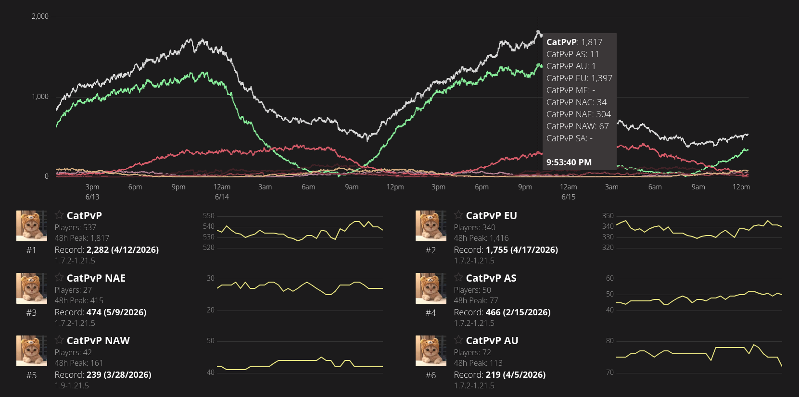
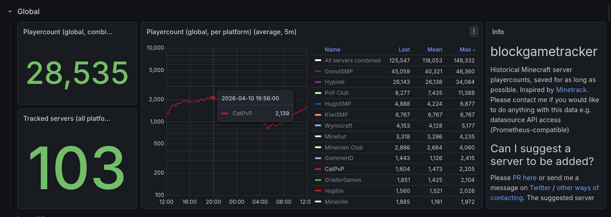

<h1 align="center">👋 Hi there!</h1>

I'm **NoboKik**, a Backend Engineer and Systems Architect specializing in high-performance, low-latency, and high-scale backend systems. With over 4 years of deep experience in Java and Linux infrastructure, I focus on building resilient scaling solutions and optimizing server-side environments.

I have a proven track record of delivering enterprise-grade infrastructure for high-profile competitive platforms, successfully managing environments exceeding **2,300+ concurrent users (CCU)** and **32,000+ daily active users (DAU)**.

  
  
   
  
  

<h2 align="center">⚒️ Stack</h2>

  &nbsp;
  &nbsp;
  &nbsp;
  &nbsp;
  &nbsp;
  &nbsp;
  
   
  &nbsp;
  &nbsp;
  &nbsp;
  &nbsp;
  &nbsp;
  &nbsp;
  

<h2 align="center">💻 Projects</h2>

<b>📈 Featured Project: CatPvP - Owner &amp; Lead Developer, Feb 2023 - Apr 2026</b>

A global competitive Minecraft duels network. Built it from scratch, ran it for three years, and successfully sold it in April 2026.

**📊 Metrics & Scale**

  
  
  
  
  
  

**⚙️ Engineering Highlights**

- **Backend:** Custom Java frameworks handling real-time player data and match state.
- **Distributed Network:** Infrastructure across 8 regions, keeping latency low for players across the world.
- **Data Layer:** Redis for in-memory caching and real-time state synchronisation, MariaDB for persistent data.

**🗺️ Regional Distribution**

Network record of 2,282 CCU on 12 April 2026 - EU 1,755 · NA-East 474 · Asia 466 · NA-West 239 · AU 219.

**📡 Global Market Position**

Independently validated at 2,205 max CCU, placing the network in the global top 10 Minecraft servers at the time - [blockgametracker dashboard](https://grafana.blockgametracker.gg/d/advrfj2/blockgametracker-2?orgId=1&from=2026-04-10T12:00:00.000Z&to=2026-04-11T12:00:00.000Z&timezone=utc&var-platform=java&var-server=$__all&refresh=30s)

